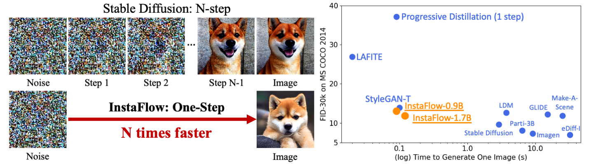
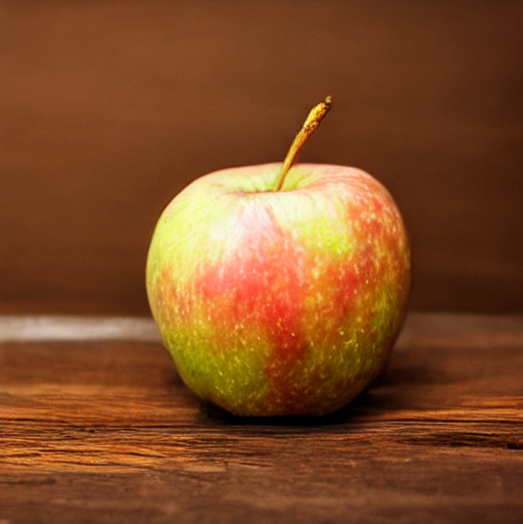
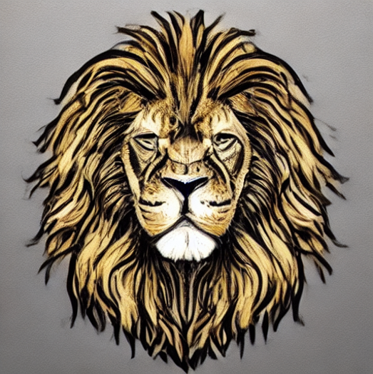
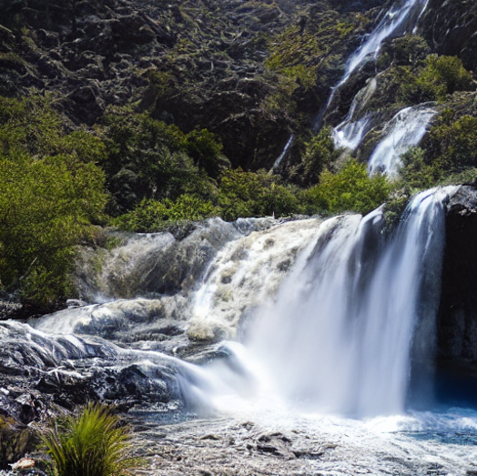
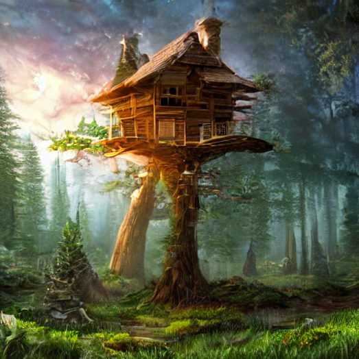
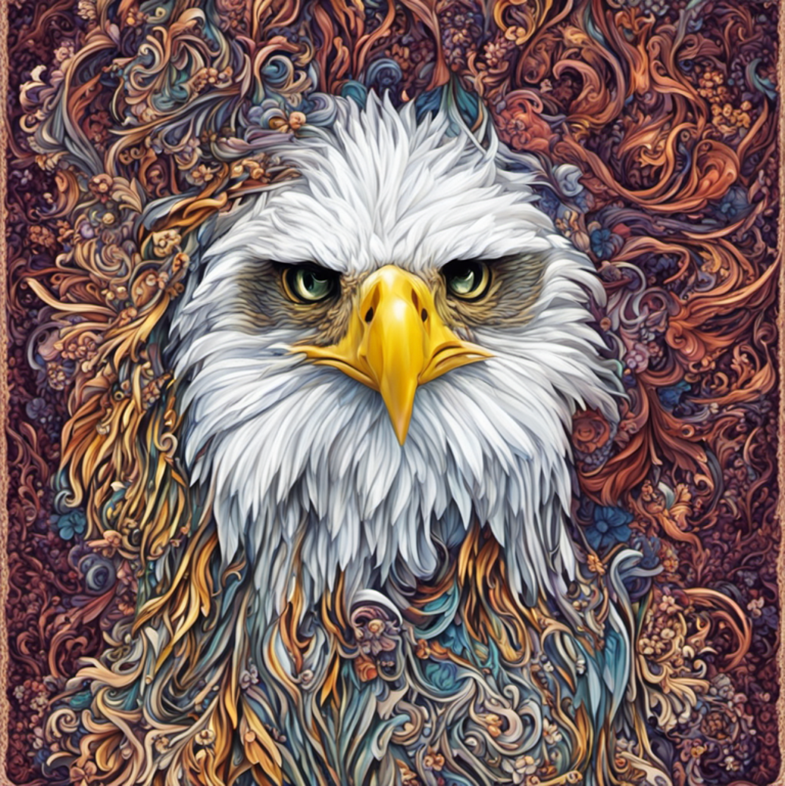
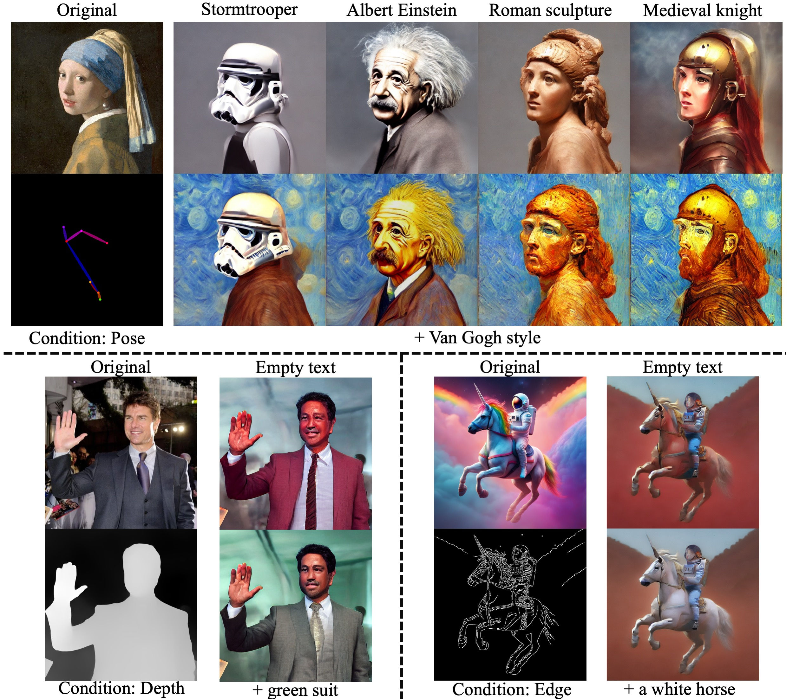

<div align="center">

## [ICLR2024] ⚡InstaFlow! One-Step Stable Diffusion with Rectified Flow

[[Paper]](https://arxiv.org/abs/2309.06380) [[Demo in 🤗Hugging Face Space]](https://huggingface.co/spaces/XCLiu/InstaFlow) [[Code and Pre-trained Models](https://github.com/gnobitab/InstaFlow/tree/main/code)][[Colab Notebook](https://colab.research.google.com/drive/1mXvIrkbWFwHcZl0sMNjrR3zGtYlrI6re?usp=sharing)]

by *Xingchao Liu, Xiwen Zhang, Jianzhu Ma, Jian Peng, Qiang Liu*  

</div>

## News 

- (NEW) 2023/05/17 Try our new few-step model PeRFlow at [here](https://github.com/magic-research/piecewise-rectified-flow)!
- 2023/12/04 We updated the [demo](https://huggingface.co/spaces/XCLiu/InstaFlow) in 🤗Hugging Face Space with InstaFlow+[dreamshaper-7](https://huggingface.co/Lykon/dreamshaper-7). Image quality significantly improves! We also provide the Gradio demo for you to run locally [here](https://github.com/gnobitab/InstaFlow/tree/main/code#local-gradio-interface).
- 2023/12/04 One-step InstaFlow is compatible with pre-trained LoRAs! See [here](https://github.com/gnobitab/InstaFlow/tree/main#lora). Code is available [here](https://github.com/gnobitab/InstaFlow/tree/main/code#adding-lora-to-2-rectified-flow-or-instaflow-09b). (We thank individual contributor [Dr. Hanshu Yan](https://hanshuyan.github.io/))  
- 2023/12/04 ONNX support is available now! [[ONNX InstaFlow]](https://huggingface.co/TheyCallMeHex/InstaFlow-0.9B-ONNX/tree/main)  [[ONNX 2-Rectified Flow]](https://huggingface.co/TheyCallMeHex/2-Rectified-Flow-ONNX)   [[ONNXStack UI]](https://github.com/saddam213/OnnxStack/releases/tag/v0.10.0) (We thank [saddam213](https://github.com/saddam213))
- 2023/11/23 Colab notebook is online now. Try it [here](https://colab.research.google.com/drive/1mXvIrkbWFwHcZl0sMNjrR3zGtYlrI6re?usp=sharing). (We thank individual contributor [
xaviviro](https://github.com/xaviviro))
- 2023/11/22 One-step InstaFlow is compatible with pre-trained ControlNets. See [here](https://github.com/gnobitab/InstaFlow/tree/main#controlnet). (We thank individual contributor [Dr. Hanshu Yan](https://hanshuyan.github.io/))
- 2023/11/22 We release the pre-trained models and inference codes [here](https://github.com/gnobitab/InstaFlow/tree/main/code).
- 2023/09/26 We provide a demo of InstaFlow-0.9B in 🤗Hugging Face Space. Try it [here](https://huggingface.co/spaces/XCLiu/InstaFlow).

## Introduction

Diffusion models have demonstrated remarkable promises in text-to-image generation. However, their efficacy is still largely hindered by computational constraints stemming from the need of iterative numerical solvers at the inference time for solving the diffusion/flow processes. 

**InstaFlow** is an ```ultra-fast```, ```one-step``` image generator that achieves image quality close to Stable Diffusion, significantly reducing the demand of computational resources. This efficiency is made possible through a recent [Rectified Flow](https://github.com/gnobitab/RectifiedFlow) technique, which trains probability flows with straight trajectories, hence inherently requiring only a single step for fast inference.

**InstaFlow** has several advantages: 
- ```Ultra-Fast Inference```: **InstaFlow** models are **one-step generators**, which directly map noises to images and avoid multi-step sampling of diffusion models. On our machine with A100 GPU, the inference time is around 0.1 second, saving ~90% of the inference time compared to the original Stable Diffusion.
- ```High-Quality```: **InstaFlow** generates images with intricate details like Stable Diffusion, and have similar FID on MS COCO 2014 as state-of-the-art text-to-image GANs, like [StyleGAN-T](https://github.com/autonomousvision/stylegan-t).
- ```Simple and Efficient Training```: The training process of **InstaFlow** merely involves **supervised training**. Leveraging pre-trained Stable Diffusion, it only takes **199 A100 GPU days** to get **InstaFlow-0.9B**.  



## Gallery

### One-step generation with InstaFlow-0.9B (0.09s per image, $512 \times 512$)

<p align="middle">
  
  
  
  
</p>

### One-step generation with InstaFlow-1.7B (0.12s per image, $512 \times 512$)

<p align="middle">
  
  
  
  
</p>

### One-step generation with InstaFlow-0.9B (0.09s) + SDXL-Refiner ($1024 \times 1024$)

<p align="middle">
  
  
</p>

### Latent space interpolation of one-step InstaFlow-0.9B (0.09s per image, $512 \times 512$)

<div align="center">


https://github.com/gnobitab/InstaFlow/assets/1157982/e8c41d7c-aa1d-4ac3-b96f-5cda847331fe


</div>

## LoRA

One-step InstaFlow is compatible with pre-trained LoRAs. We thank individual contributor [Dr. Hanshu Yan](https://hanshuyan.github.io/) for providing and testing the *Rectified Flow+LoRA* pipeline!

InstaFlow seems to have higher diversity than SDXL-Turbo.


https://github.com/gnobitab/InstaFlow/assets/1157982/8f12960e-116d-486a-a2e9-448d745394c2


## ControlNet

One-step InstaFlow is fully compatible with pre-trained ControlNets. We thank individual contributor [Dr. Hanshu Yan](https://hanshuyan.github.io/) for providing and testing the *Rectified Flow+ControlNet* pipeline!

Below are **One-Step Generation** with InstaFlow-0.9B + ControlNet:

 


## Comparison with SD 1.5 on our A100 machine

For an intuitive understanding, we used the same A100 server and took screenshots from the Gridio interface of random generation with different models. InstaFlow-0.9B is one-step, while SD 1.5 adopts 25-step [DPMSolver](https://github.com/LuChengTHU/dpm-solver). It takes around 0.3 second to download the image from the server. The text prompt is *"A photograph of a snowy mountain near a beautiful lake under sunshine."*


| &emsp; &emsp; &emsp; &emsp; &emsp; &emsp;   InstaFlow-0.9B &emsp; &emsp; &emsp; &emsp; &emsp; &emsp; &emsp;|  &emsp; &emsp; &emsp; &emsp; &emsp; &emsp;  Stable Diffusion 1.5 &emsp; &emsp; &emsp; &emsp; &emsp;|
|:-:|:-:|


## Method: Straightening Generative Probability Flows with Text-Conditioned Reflow

<div align="center">


https://github.com/gnobitab/InstaFlow/assets/1157982/897e2d1a-eff9-44bf-ab89-bc26bbc0d8a7

 
</div>

<p align="middle">
  
</p>

Our pipeline consists of three steps:

1. Generate (text, noise, image) triplets from pre-trained Stable Diffusion
2. Apply ```text-conditioned reflow``` to yield 2-Rectified Flow, which is a straightened generative probability flow.
3. Distill from 2-Rectified Flow to get **One-Step InstaFlow**. Note that distillation and reflow are ```orthogonal techniques```.

As captured in the video and the image, straight flows have the following advantages:

* Straight flows require fewer steps to simulate.
* Straight flows give better coupling between the noise distribution and the image distribution, thus allow successful distillation.


## Related Materials

We provide several related links and readings here:

* The official Rectified Flow github repo (https://github.com/gnobitab/RectifiedFlow)

* An introduction of Rectified Flow (https://www.cs.utexas.edu/~lqiang/rectflow/html/intro.html)

* An introduction of Rectified Flow in Chinese--Zhihu (https://zhuanlan.zhihu.com/p/603740431)

* FlowGrad: Controlling the Output of Generative ODEs With Gradients (https://github.com/gnobitab/FlowGrad)

* Fast Point Cloud Generation with Straight Flows (https://github.com/klightz/PSF)

* Piecewise Rectified Flow (https://github.com/magic-research/piecewise-rectified-flow)

## Citation

```
@inproceedings{liu2023instaflow,
  title={Instaflow: One step is enough for high-quality diffusion-based text-to-image generation},
  author={Liu, Xingchao and Zhang, Xiwen and Ma, Jianzhu and Peng, Jian and Liu, Qiang},
  booktitle={International Conference on Learning Representations},
  year={2024}
}
```

## Thanks

Our training scripts are modified from [one of the fine-tuning examples in Diffusers](https://github.com/huggingface/diffusers/blob/main/examples/text_to_image/train_text_to_image.py).
Other parts of our work also heavily relies on the [🤗 Diffusers](https://github.com/huggingface/diffusers) library.

